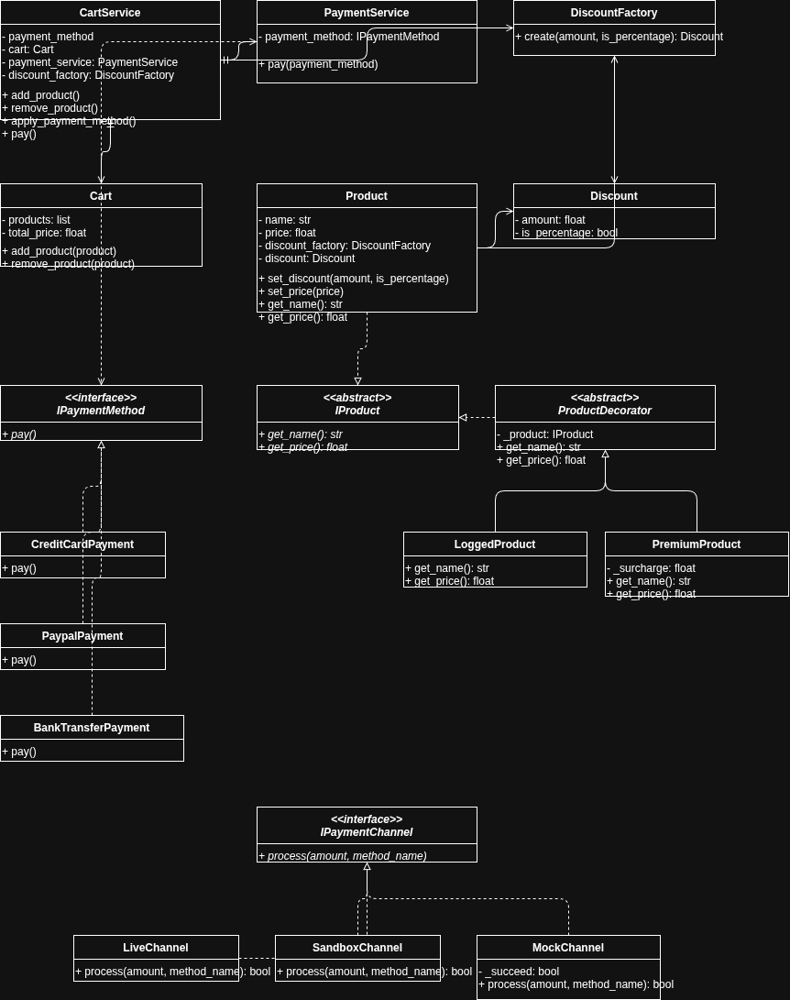

# E-Commerce OOP Architecture Project

## Projenin Amacı

Bu proje, bir e-ticaret sepet sistemi üzerinden:
- OOP prensiplerini
- SOLID yaklaşımını
- Design Pattern kullanımını

öğrenmek ve uygulamak için geliştirilmiştir.

---

## Mimari Diyagram

## Kullanılan Tasarım Örüntüleri

### 1. Strategy Pattern (Payment)

- IPaymentMethod ile ödeme yöntemleri soyutlandı
- CreditCard, Paypal, BankTransfer ayrı sınıflar

**Amaç:**
Ödeme işlemlerini if-else yerine davranış bazlı yapmak.

---

### 2. Factory Pattern (Discount)

- DiscountFactory nesne üretimini yönetir

**Amaç:**
Object creation logic’i merkezileştirmek.

---

### 3. Service Layer Pattern

- CartService business logic’i yönetir

**Amaç:**
Domain ve business logic’i ayırmak.

---

### 4. Dependency Injection

- Payment method dışarıdan verilir

**Amaç:**
Loose coupling sağlamak.

---

### 5. Decorator Pattern

- LoggedProduct
- PremiumProduct

**Amaç:**
Product davranışını runtime’da genişletmek.

---

### 6. Composition

- CartService → Cart + PaymentService

**Amaç:**
Inheritance yerine object composition kullanmak.

---

### 7. Payment Channel Strategy

- LiveChannel
- SandboxChannel
- MockChannel

**Amaç:**
Ödeme ortamlarını birbirinden ayırmak.

---
